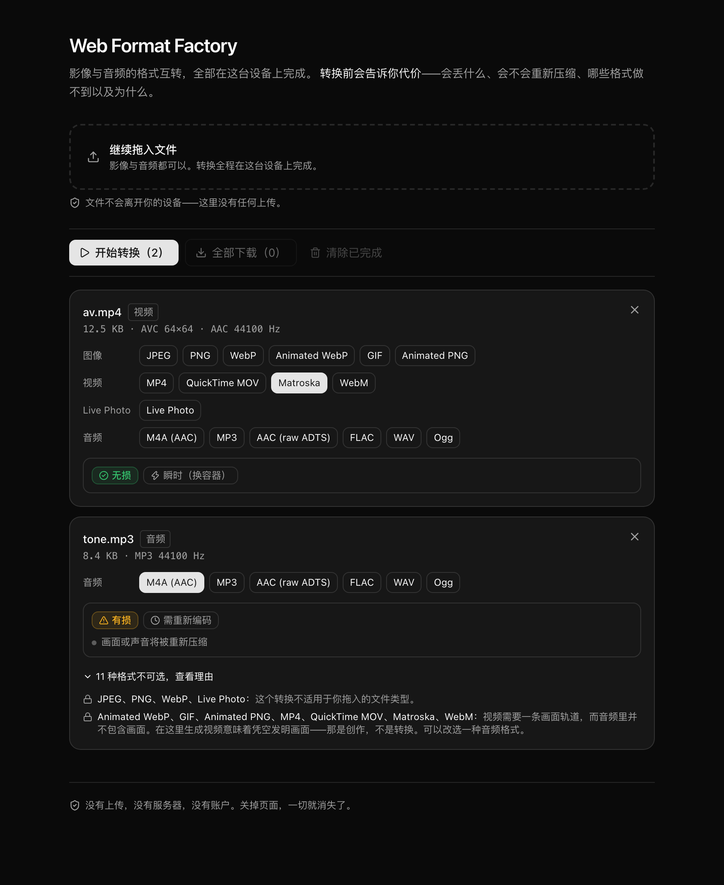
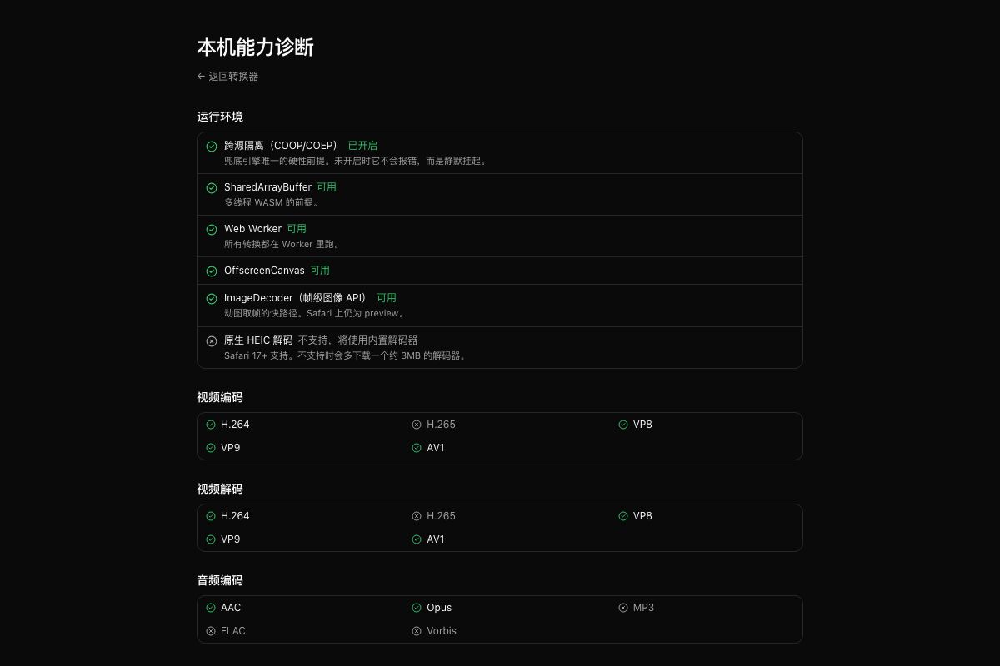

# Web Format Factory

一个**完全在浏览器本地运行**的多媒体格式转换器——文件不离开你的设备。



## 这是什么？

- **定位**：纯前端（client-side）的多媒体格式转换工具，覆盖影像与音频两条线。
- **解决的核心问题**：现有在线转换器几乎都要求「上传 → 服务端转码 → 下载」。这对隐私敏感内容、
  大文件、以及内网环境都不可接受。本项目把解码与重编码全部放在浏览器内完成。

覆盖格式：

- **影像线**：GIF、WebP（含动态）、WebM、Live Photo、JPEG、PNG、MP4、MOV、MKV
- **音频线**：M4A、MP3、AAC、FLAC、WAV、OGG

## 为什么存在？

「不上传」不是宣传语，而是架构的第一性前提。它排除了「服务端跑原生 ffmpeg」这条最省力的路，
直接决定了性能天花板、内存上限与包体策略——例如为什么必须以 WebCodecs 硬件编解码为主干、
为什么 WASM 引擎要懒加载、为什么 PWA 绝不预缓存 WASM 核心。

本项目的第二个主张是**诚实**。转换是有代价的，而多数工具对此沉默：
丢掉 alpha、丢掉音轨、丢掉 EXIF 与 GPS、把有损源转成「无损」格式却毫无增益。
本项目在用户按下「开始」之前就把这些代价摊开讲清楚，并且**拒绝执行那些必须凭空发明内容的转换**
（例如音频转视频）。

## 如何安装和运行？

前置要求：Node.js ≥ 22、pnpm 12。

```bash
pnpm install          # 安装依赖
pnpm dev              # 启动开发服务器（已注入 COOP/COEP 响应头）
pnpm build            # 类型检查 + 生产构建
pnpm test             # 单元测试
pnpm test:e2e         # 端到端测试（需要先 pnpm fixtures 生成样本）
pnpm fixtures         # 用本机 ffmpeg/sips 等工具生成测试样本
```

开发服务器地址默认 `http://localhost:5173`。

## 当前状态

**阶段：功能完整的原型。影像线、音频线、动图线与 Live Photo 双向均已端到端跑通。**

已完成：

- 转换语义模型：转换类别推导、保真度、损失标注（纯逻辑，完整单测覆盖）
- 格式注册表与「范围白名单」——产品边界的唯一收口点，且有测试守护
- 能力矩阵与「不可能转换」的归因文案（按理由归并展示）
- 探测层：魔数嗅探 + 轨道解析 + 动图检测 + 透明通道检测，全部按内容识别、不看扩展名
- 主干引擎（Mediabunny）与「基于编码」的复制/转码判定
- 图像线：JPEG / PNG / WebP 静图互转，含 EXIF 方向与透明通道处理；
  **HEIC 解码**——Safari 走原生快路径，其余浏览器按需取回约 3 MB 的 WASM 解码器
- 动图线：视频 ↔ GIF 双向，含调色板与抖动；动态 WebP 与 APNG 的取帧走浏览器自带的
  `ImageDecoder`，这条路上不必惊动兜底引擎
- 音频线：M4A / MP3 / AAC / FLAC / WAV / OGG 互转；浏览器没有的 MP3、FLAC、AAC
  编码器按需取回 WASM 扩展
- Live Photo：四种形态的识别与拆包、**从视频组装**（写入 Apple 配对标识）、
  **多文件拖入的自动配对**、**手动配对与解除配对**（三种配对来源分别如实标注）；
  导出静图时会剥掉已经失效的 Motion Photo 声明
- Motion Photo（Google 的单文件形态）：由视频或已有 Live Photo 组装成一张尾部拼着 MP4 的 JPEG。
  **不需要兜底引擎**，且现成的静图能原样搬运时绝不重新编码
- 兜底引擎（ffmpeg.wasm）：按需加载、跨源隔离检测、WORKERFS 挂载，
  用于动态 WebP / APNG 编码、真 Vorbis 编码与 Live Photo 的配对标识写入
- 编码参数界面：由各格式自己声明的参数表渲染，改设置会改变代价判定，并真的传到编码器
- 转换 Worker 与调度，主线程不卡
- 可用界面：拖拽 → 识别 → 选目标 → 代价清单 → 转换 → 下载
- 诊断页 `#/capabilities`：实测本机的跨源隔离、编解码器可用性、原生 HEIC 支持，
  并翻译成「这对应用意味着什么」
- 部署配置样例（`deploy/`）与一份无依赖的参考服务器（`scripts/serve-deploy.mjs`）
- 测试：单元与集成 183 项；Playwright 端到端 48 项跑 dev server，另有 6 项跑**构建产物**
  （`pnpm test:e2e:prod`）。产物一律交给 ffprobe 校验



已知限制：

- 分辨率缩放、帧率调整、裁剪、截取片段**不在范围内**（见 `docs/PRD.md` 的语义边界）。
- 跨编码的转换（如 MP4 → WebM）依赖浏览器的 WebCodecs 硬件编码器，可用性因平台而异，
  界面尚不会主动提示降级。
- **组装 Live Photo 必须下载约 31 MB 的兜底引擎**，且页面须开启跨源隔离（COOP/COEP），
  因为 Apple 的配对标识只能由 ffmpeg 写入——这是实测结论，详见 `docs/DECISIONS.md` ADR-004。
  缺少响应头时界面会明确说明，而不是让转换一直停在那里。
- **Apple 的 `still-image-time` 定时元数据轨道不写入**：语义已经查清，字节布局没有，
  而手上没有一份 Apple 亲自产出的 MOV 可作参照。理由与解锁条件见 `docs/DECISIONS.md`
  ADR-009——这是一次有意的取舍，不是遗漏。
- **Apple 静图那一侧的配对标识既不写、也可能读错了字段**：写出的 `.livp` 只有 MOV 一侧带标识；
  而我们的探测器从静图的 XMP 读它，两份独立来源却说 Apple 写在 EXIF MakerNote 里。
  若属实则真实 Apple 文件的配对会退到文件名——而本项目自造的样本恰好写了 XMP 那个字段，
  所以往返测试看不出差别。定论需要一份真实 Apple 静图，详见 `docs/specs/live-photo.md`。
- `deploy/` 下的 nginx / Caddy 样例**未经真实服务器验证**：写这份代码的机器上没有 nginx，
  也没有容器。行为面由参考服务器覆盖，配置面由单测覆盖，但两者之间仍有一段是推断。

## 核心技术

| 层 | 选型 |
| --- | --- |
| 构建 | Vite 8（Rolldown 内核）+ TypeScript 7 |
| UI | React 19 + Tailwind CSS 4 + shadcn/ui |
| 离线 | vite-plugin-pwa（仅预缓存外壳） |
| 主干引擎 | Mediabunny（基于 WebCodecs，硬件加速） |
| 图像/动图 | Canvas / ImageDecoder、jSquash、gifski、libheif |
| 兜底引擎 | ffmpeg.wasm（懒加载） |

**详细文档见 `docs/`**：产品语义边界见 `docs/PRD.md`，引擎分层见 `docs/ARCHITECTURE.md`，
关键取舍的理由见 `docs/DECISIONS.md`。
